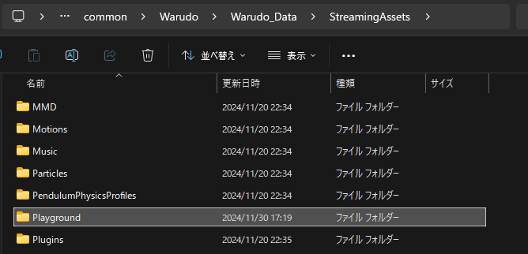
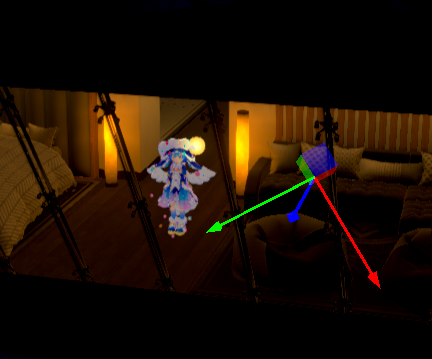
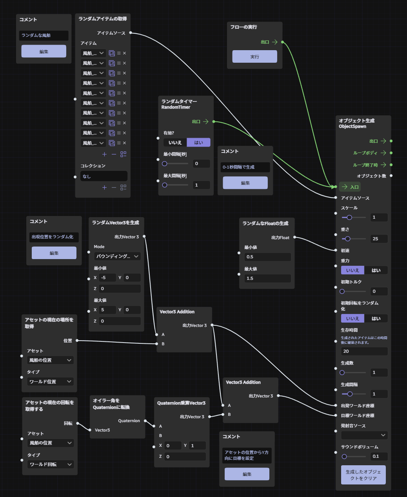

# Warudo用の演出システム

## ノードの追加方法

Warudo のメニューから「データフォルダを開く」をクリック


`Playground` フォルダーの中に配置する




## ブループリントJSONのインポート方法

Warudo のブループリントのメニューから「クリップボードからブループリントをインポート」をクリックする。


## 流れ星


### 必要ノード

* [EnumToIntegerNode](./src/EnumToIntegerNode.cs)
* [ObjectSpawnNode](./src/ObjectSpawnNode.cs)

### アセット設定

流れ星の発生位置を指定するための道具を追加する。




### ブループリント


```json
{"id":"2593deab-2073-499d-ac3a-c004e04c74db","enabled":false,"name":"流れ星","order":0,"group":null,"panningX":1659.29236,"panningY":1042.02515,"scaling":0.7851317,"nodes":{"1b39aafc-7703-41e5-aef9-184fa8b76191":{"id":"1b39aafc-7703-41e5-aef9-184fa8b76191","dataInputs":{"ValueMin":{"type":"float","value":"2.0"},"ValueMax":{"type":"float","value":"4.0"}},"typeId":"4bfdcec6-6386-4e4c-a8e7-b85af716779f","name":"GENERATE_RANDOM_FLOAT","x":-208.089,"y":-412.6447},"75159e30-9bd2-4fa5-8973-67a6553f5493":{"id":"75159e30-9bd2-4fa5-8973-67a6553f5493","dataInputs":{},"typeId":"e9514743-a68f-41d3-9679-17f061df2b0e","name":"INVOKE_FLOW","x":-256.316742,"y":-971.0233},"9de58226-673c-4d52-8d5c-3b5d31eaae87":{"id":"9de58226-673c-4d52-8d5c-3b5d31eaae87","dataInputs":{"Asset":{"type":"Warudo.Plugins.Core.Assets.GameObjectAsset","value":"{\"id\":\"2c01e58c-58ac-4402-8eb3-7d398323f37f\",\"name\":\"流れ星の位置\"}"},"Type":{"type":"Warudo.Plugins.Core.Nodes.GetAssetPositionNode+BonePositionType","value":"{\"label\":\"ワールド位置\",\"value\":0,\"description\":null,\"icon\":null}"}},"typeId":"0ec85386-3753-4ed0-be9b-69e86e685ffd","name":"GET_ASSET_POSITION","x":-921.218567,"y":-79.9529},"ac5df5ef-328f-44f2-8c36-9db15882b43a":{"id":"ac5df5ef-328f-44f2-8c36-9db15882b43a","dataInputs":{"Text":{"type":"string","value":"\"アセットの位置からY方向に目標を設定\""},"Content":{"type":"string","value":"\"アセットの位置からY方向に目標を設定\""},"Editing":{"type":"bool","value":"false"}},"typeId":"200ee639-79bc-492c-a14c-a6b64cfcf39d","name":"COMMENT","x":-208.088974,"y":342.027679},"7d5a5519-0642-4f56-a425-e9aaf7da06ca":{"id":"7d5a5519-0642-4f56-a425-e9aaf7da06ca","dataInputs":{"Text":{"type":"string","value":"\"0-1秒間隔で生成\\n\""},"Content":{"type":"string","value":"\"0-1秒間隔で生成\\n\""},"Editing":{"type":"bool","value":"false"}},"typeId":"200ee639-79bc-492c-a14c-a6b64cfcf39d","name":"COMMENT","x":-740.7416,"y":-764.182068},"e41e4034-6e60-4b90-8cd7-87133823d7d9":{"id":"e41e4034-6e60-4b90-8cd7-87133823d7d9","dataInputs":{"Enabled":{"type":"bool","value":"true"},"MinInterval":{"type":"float","value":"0.0"},"MaxInterval":{"type":"float","value":"1.0"}},"typeId":"b5ccd3d1-0000-4d8a-9a18-ff6a78135a4c","name":"ランダムタイマー RandomTimer","x":-495.1195,"y":-867.635742},"a905ad0e-886f-4872-8b11-7ce9141132ed":{"id":"a905ad0e-886f-4872-8b11-7ce9141132ed","dataInputs":{"Asset":{"type":"Warudo.Plugins.Core.Assets.GameObjectAsset","value":"{\"id\":\"2c01e58c-58ac-4402-8eb3-7d398323f37f\",\"name\":\"流れ星の位置\"}"},"Type":{"type":"Warudo.Plugins.Core.Nodes.GetAssetRotationNode+BonePositionType","value":"{\"label\":\"ワールド回転\",\"value\":0,\"description\":null,\"icon\":null}"}},"typeId":"56174e95-d961-4add-bcb8-84fe9b6b8905","name":"GET_ASSET_ROTATION","x":-919.5151,"y":219.142853},"dab37d3e-69e5-4280-bb46-7dac813abcf7":{"id":"dab37d3e-69e5-4280-bb46-7dac813abcf7","dataInputs":{"Vector3":{"type":"UnityEngine.Vector3","value":"{\"x\":-5.0038147,\"y\":3.60512686,\"z\":6.902316}"},"Offset":{"type":"UnityEngine.Vector3","value":"{\"x\":0.8455721,\"y\":-0.53386116,\"z\":0.0}"}},"typeId":"b305f867-39c7-4eb8-ad89-8860bd05ba27","name":"VECTOR3_ADDITION","x":-195.38266,"y":148.735062},"c84c49d4-4b08-4f15-8f37-1d5b7c43236f":{"id":"c84c49d4-4b08-4f15-8f37-1d5b7c43236f","dataInputs":{"X":{"type":"float","value":"0.0"},"Y":{"type":"float","value":"0.0"},"Z":{"type":"float","value":"0.0"},"W":{"type":"float","value":"0.0"}},"typeId":"e274653f-32d7-4da4-bec6-992cc2bc28f1","name":"QUATERNION","x":1885.86865,"y":-703.8174},"9c2a393a-494f-47b4-8890-95badf427ba4":{"id":"9c2a393a-494f-47b4-8890-95badf427ba4","dataInputs":{"X":{"type":"float","value":"0.0"},"Y":{"type":"float","value":"0.0"},"Z":{"type":"float","value":"0.0"},"W":{"type":"float","value":"0.0"}},"typeId":"e274653f-32d7-4da4-bec6-992cc2bc28f1","name":"QUATERNION","x":1885.86865,"y":-703.8174},"ec782d6b-396e-48af-8dc2-551ec3dea0de":{"id":"ec782d6b-396e-48af-8dc2-551ec3dea0de","dataInputs":{"Vector3":{"type":"UnityEngine.Vector3","value":"{\"x\":0.0,\"y\":0.0,\"z\":237.733276}"}},"typeId":"e681877d-01e5-4ae4-8f91-68929e8b13a4","name":"CONVERT_EULER_ANGLES_TO_QUATERNION","x":-675.383362,"y":211.962631},"63ccaccc-bb4e-49ef-91d0-3284372924cf":{"id":"63ccaccc-bb4e-49ef-91d0-3284372924cf","dataInputs":{"A":{"type":"UnityEngine.Quaternion","value":"{\"x\":0.0,\"y\":0.0,\"z\":0.8757457,\"w\":-0.482772619}"},"B":{"type":"UnityEngine.Vector3","value":"{\"x\":0.0,\"y\":1.0,\"z\":0.0}"}},"typeId":"45b44ac3-7441-4821-a880-0eafe7751b53","name":"QUATERNION_MULTIPLY_VECTOR3","x":-443.457916,"y":219.435715},"54729aec-bf6a-4000-a836-475705efb290":{"id":"54729aec-bf6a-4000-a836-475705efb290","dataInputs":{"Mode":{"type":"Warudo.Plugins.Core.Nodes.GenerateRandomVector3Node+ModeType","value":"{\"label\":\"バウンディングボックス内\",\"value\":0,\"description\":null,\"icon\":null}"},"ValueMin":{"type":"UnityEngine.Vector3","value":"{\"x\":-2.0,\"y\":-2.0,\"z\":-1.0}"},"ValueMax":{"type":"UnityEngine.Vector3","value":"{\"x\":2.0,\"y\":2.0,\"z\":1.0}"},"SphereRadius":{"type":"float","value":"1.0"}},"typeId":"6fd17913-c526-4402-a857-30c585ae6254","name":"GENERATE_RANDOM_VECTOR3","x":-679.379456,"y":-431.126251},"2a9eab3b-05d3-4ab2-a867-02cfac2f4df1":{"id":"2a9eab3b-05d3-4ab2-a867-02cfac2f4df1","dataInputs":{"Vector3":{"type":"UnityEngine.Vector3","value":"{\"x\":-1.69204187,\"y\":0.569982,\"z\":0.247160554}"},"Offset":{"type":"UnityEngine.Vector3","value":"{\"x\":-3.31177282,\"y\":3.03514481,\"z\":6.65515566}"}},"typeId":"b305f867-39c7-4eb8-ad89-8860bd05ba27","name":"VECTOR3_ADDITION","x":-434.275818,"y":-106.347946},"314a05a4-0170-466b-88c0-18b5c35a0b0c":{"id":"314a05a4-0170-466b-88c0-18b5c35a0b0c","dataInputs":{"PropSource":{"type":"string","value":"\"gameobject://resources/Particles/VicVic Particles/STAR b PARTICLE\""},"Scale":{"type":"float","value":"1.0"},"Mass":{"type":"float","value":"25.0"},"Speed":{"type":"float","value":"2.477983"},"Gravity":{"type":"bool","value":"false"},"LaunchTorque":{"type":"float","value":"0.0"},"RandomizeLaunchRotation":{"type":"bool","value":"false"},"AliveTime":{"type":"float","value":"5.0"},"SpawnCount":{"type":"int","value":"1"},"SpawnInterval":{"type":"float","value":"1.0"},"FromWorldPosition":{"type":"UnityEngine.Vector3","value":"{\"x\":-5.0038147,\"y\":3.60512686,\"z\":6.902316}"},"ToWorldPosition":{"type":"UnityEngine.Vector3","value":"{\"x\":-4.1582427,\"y\":3.0712657,\"z\":6.902316}"},"LaunchSoundSource":{"type":"string","value":null},"SoundVolume":{"type":"float","value":"0.1"}},"typeId":"41135db6-982d-4e90-8094-933123eb781f","name":"オブジェクト生成 ObjectSpawn","x":95.64365,"y":-750.0949},"05c2b59a-f222-41d6-9b82-35aafb5b208f":{"id":"05c2b59a-f222-41d6-9b82-35aafb5b208f","dataInputs":{"Text":{"type":"string","value":"\"出現位置をランダム化\""},"Content":{"type":"string","value":"\"出現位置をランダム化\""},"Editing":{"type":"bool","value":"false"}},"typeId":"200ee639-79bc-492c-a14c-a6b64cfcf39d","name":"COMMENT","x":-904.0646,"y":-435.005371}},"dataConnections":[{"outputNode":"1b39aafc-7703-41e5-aef9-184fa8b76191","inputNode":"314a05a4-0170-466b-88c0-18b5c35a0b0c","outputPort":"Result","inputPort":"Speed"},{"outputNode":"dab37d3e-69e5-4280-bb46-7dac813abcf7","inputNode":"314a05a4-0170-466b-88c0-18b5c35a0b0c","outputPort":"OutputVector3","inputPort":"ToWorldPosition"},{"outputNode":"2a9eab3b-05d3-4ab2-a867-02cfac2f4df1","inputNode":"314a05a4-0170-466b-88c0-18b5c35a0b0c","outputPort":"OutputVector3","inputPort":"FromWorldPosition"},{"outputNode":"2a9eab3b-05d3-4ab2-a867-02cfac2f4df1","inputNode":"dab37d3e-69e5-4280-bb46-7dac813abcf7","outputPort":"OutputVector3","inputPort":"Vector3"},{"outputNode":"63ccaccc-bb4e-49ef-91d0-3284372924cf","inputNode":"dab37d3e-69e5-4280-bb46-7dac813abcf7","outputPort":"Result","inputPort":"Offset"},{"outputNode":"a905ad0e-886f-4872-8b11-7ce9141132ed","inputNode":"ec782d6b-396e-48af-8dc2-551ec3dea0de","outputPort":"WorldRotation","inputPort":"Vector3"},{"outputNode":"ec782d6b-396e-48af-8dc2-551ec3dea0de","inputNode":"63ccaccc-bb4e-49ef-91d0-3284372924cf","outputPort":"Quaternion","inputPort":"A"},{"outputNode":"9de58226-673c-4d52-8d5c-3b5d31eaae87","inputNode":"2a9eab3b-05d3-4ab2-a867-02cfac2f4df1","outputPort":"WorldPosition","inputPort":"Offset"},{"outputNode":"54729aec-bf6a-4000-a836-475705efb290","inputNode":"2a9eab3b-05d3-4ab2-a867-02cfac2f4df1","outputPort":"Result","inputPort":"Vector3"}],"flowConnections":[{"outputNode":"e41e4034-6e60-4b90-8cd7-87133823d7d9","inputNode":"314a05a4-0170-466b-88c0-18b5c35a0b0c","outputPort":"Exit","inputPort":"Enter"},{"outputNode":"75159e30-9bd2-4fa5-8973-67a6553f5493","inputNode":"314a05a4-0170-466b-88c0-18b5c35a0b0c","outputPort":"Exit","inputPort":"Enter"}],"properties":{"id":"14d9e224-78b5-45ee-8192-da1188a036cf","dataInputs":{"Variables":{"type":"Warudo.Core.Graphs.GraphVariable[]","value":"[]"}}}}
```


## 風船


### 必要ノード

* [EnumToIntegerNode](./src/EnumToIntegerNode.cs)
* [ObjectSpawnNode](./src/ObjectSpawnNode.cs)

### 必要アセット

* [カラフルバルーンset（colorful balloon set）](https://steamcommunity.com/sharedfiles/filedetails/?id=3251960433)

### アセット設定

風船の発生位置を指定するための道具を追加する。


### ブループリント



```json
{"id":"a979a01e-4278-4207-91ae-2c14dcd72193","enabled":false,"name":"風船","order":0,"group":null,"panningX":1843.94531,"panningY":1058.65234,"scaling":0.7069484,"nodes":{"a7b03370-e819-461a-abcd-27de316785ea":{"id":"a7b03370-e819-461a-abcd-27de316785ea","dataInputs":{},"typeId":"e9514743-a68f-41d3-9679-17f061df2b0e","name":"INVOKE_FLOW","x":-387.111084,"y":-888.496643},"4ed6719b-2fc3-4a82-a124-6fec83fe6943":{"id":"4ed6719b-2fc3-4a82-a124-6fec83fe6943","dataInputs":{"Props":{"type":"string[]","value":"[\"prop://workshop/3251960433/Props/風船_エメラルド(emerald_balloon).warudo\",\"prop://workshop/3251960433/Props/風船_オレンジ(orange_balloon).warudo\",\"prop://workshop/3251960433/Props/風船_ピンク(pink_balloon).warudo\",\"prop://workshop/3251960433/Props/風船_水色(skyblue_balloon).warudo\",\"prop://workshop/3251960433/Props/風船_白(white_balloon).warudo\",\"prop://workshop/3251960433/Props/風船_紫(purple_balloon).warudo\",\"prop://workshop/3251960433/Props/風船_緑(green_balloon).warudo\",\"prop://workshop/3251960433/Props/風船_赤(Red_balloon).warudo\",\"prop://workshop/3251960433/Props/風船_青(blue_balloon).warudo\",\"prop://workshop/3251960433/Props/風船_黄色(yellow_balloon).warudo\"]"},"Collections":{"type":"string[]","value":"[]"}},"typeId":"6c1c5d66-9596-4c21-88fc-94b2f4771d1d","name":"GET_RANDOM_PROP","x":-935.0081,"y":-918.3322},"7c1a6287-256d-4253-a2a9-d6845e81f30a":{"id":"7c1a6287-256d-4253-a2a9-d6845e81f30a","dataInputs":{"ValueMin":{"type":"float","value":"0.5"},"ValueMax":{"type":"float","value":"1.5"}},"typeId":"4bfdcec6-6386-4e4c-a8e7-b85af716779f","name":"GENERATE_RANDOM_FLOAT","x":-343.509247,"y":-180.62413},"6b8c10ed-814e-4819-b02c-7a97e1a32c6a":{"id":"6b8c10ed-814e-4819-b02c-7a97e1a32c6a","dataInputs":{"Asset":{"type":"Warudo.Plugins.Core.Assets.GameObjectAsset","value":"{\"id\":\"994b19a7-1e8c-4914-b165-d9022e70a054\",\"name\":\"風船の位置\"}"},"Type":{"type":"Warudo.Plugins.Core.Nodes.GetAssetPositionNode+BonePositionType","value":"{\"label\":\"ワールド位置\",\"value\":0,\"description\":null,\"icon\":null}"}},"typeId":"0ec85386-3753-4ed0-be9b-69e86e685ffd","name":"GET_ASSET_POSITION","x":-1128.06,"y":167.748291},"bc328ece-b60a-4d81-bcbb-956931b58d02":{"id":"bc328ece-b60a-4d81-bcbb-956931b58d02","dataInputs":{"Text":{"type":"string","value":"\"アセットの位置からY方向に目標を設定\""},"Content":{"type":"string","value":"\"アセットの位置からY方向に目標を設定\""},"Editing":{"type":"bool","value":"false"}},"typeId":"200ee639-79bc-492c-a14c-a6b64cfcf39d","name":"COMMENT","x":-414.93042,"y":589.7289},"a5c76a52-c7d0-4b42-aee8-a6c5111e5f19":{"id":"a5c76a52-c7d0-4b42-aee8-a6c5111e5f19","dataInputs":{"Asset":{"type":"Warudo.Plugins.Core.Assets.GameObjectAsset","value":"{\"id\":\"994b19a7-1e8c-4914-b165-d9022e70a054\",\"name\":\"風船の位置\"}"},"Type":{"type":"Warudo.Plugins.Core.Nodes.GetAssetRotationNode+BonePositionType","value":"{\"label\":\"ワールド回転\",\"value\":0,\"description\":null,\"icon\":null}"}},"typeId":"56174e95-d961-4add-bcb8-84fe9b6b8905","name":"GET_ASSET_ROTATION","x":-1126.35657,"y":466.844055},"896988a9-bf23-4d6f-bac7-acbf4ffa89aa":{"id":"896988a9-bf23-4d6f-bac7-acbf4ffa89aa","dataInputs":{"Vector3":{"type":"UnityEngine.Vector3","value":"{\"x\":4.288851,\"y\":-1.61305165,\"z\":6.64072466}"},"Offset":{"type":"UnityEngine.Vector3","value":"{\"x\":0.0,\"y\":1.0,\"z\":0.0}"}},"typeId":"b305f867-39c7-4eb8-ad89-8860bd05ba27","name":"VECTOR3_ADDITION","x":-402.224121,"y":396.436249},"20ba0c52-e1e1-4497-a79f-6157175478f2":{"id":"20ba0c52-e1e1-4497-a79f-6157175478f2","dataInputs":{"Vector3":{"type":"UnityEngine.Vector3","value":"{\"x\":0.0,\"y\":0.0,\"z\":0.0}"}},"typeId":"e681877d-01e5-4ae4-8f91-68929e8b13a4","name":"CONVERT_EULER_ANGLES_TO_QUATERNION","x":-882.2248,"y":459.663818},"4a0474d1-c963-4d3f-8405-d749609f7d39":{"id":"4a0474d1-c963-4d3f-8405-d749609f7d39","dataInputs":{"A":{"type":"UnityEngine.Quaternion","value":"{\"x\":0.0,\"y\":0.0,\"z\":0.0,\"w\":1.0}"},"B":{"type":"UnityEngine.Vector3","value":"{\"x\":0.0,\"y\":1.0,\"z\":0.0}"}},"typeId":"45b44ac3-7441-4821-a880-0eafe7751b53","name":"QUATERNION_MULTIPLY_VECTOR3","x":-650.2994,"y":467.1369},"d525221b-3583-456a-a059-453bd1939d17":{"id":"d525221b-3583-456a-a059-453bd1939d17","dataInputs":{"Mode":{"type":"Warudo.Plugins.Core.Nodes.GenerateRandomVector3Node+ModeType","value":"{\"label\":\"バウンディングボックス内\",\"value\":0,\"description\":null,\"icon\":null}"},"ValueMin":{"type":"UnityEngine.Vector3","value":"{\"x\":-5.0,\"y\":0.0,\"z\":0.0}"},"ValueMax":{"type":"UnityEngine.Vector3","value":"{\"x\":5.0,\"y\":0.0,\"z\":0.0}"},"SphereRadius":{"type":"float","value":"1.0"}},"typeId":"6fd17913-c526-4402-a857-30c585ae6254","name":"GENERATE_RANDOM_VECTOR3","x":-886.220947,"y":-183.425049},"6e4c99d9-2316-419e-9474-26521904887d":{"id":"6e4c99d9-2316-419e-9474-26521904887d","dataInputs":{"Vector3":{"type":"UnityEngine.Vector3","value":"{\"x\":4.87482166,\"y\":0.0,\"z\":0.0}"},"Offset":{"type":"UnityEngine.Vector3","value":"{\"x\":-0.5859711,\"y\":-1.61305165,\"z\":6.64072466}"}},"typeId":"b305f867-39c7-4eb8-ad89-8860bd05ba27","name":"VECTOR3_ADDITION","x":-641.117249,"y":141.353256},"53860543-594f-42bb-905d-9cec0b15c6d4":{"id":"53860543-594f-42bb-905d-9cec0b15c6d4","dataInputs":{"Text":{"type":"string","value":"\"出現位置をランダム化\""},"Content":{"type":"string","value":"\"出現位置をランダム化\""},"Editing":{"type":"bool","value":"false"}},"typeId":"200ee639-79bc-492c-a14c-a6b64cfcf39d","name":"COMMENT","x":-1110.906,"y":-187.304169},"151700b7-ed1f-4f33-b285-9871e50e1943":{"id":"151700b7-ed1f-4f33-b285-9871e50e1943","dataInputs":{"Enabled":{"type":"bool","value":"true"},"MinInterval":{"type":"float","value":"0.0"},"MaxInterval":{"type":"float","value":"1.0"}},"typeId":"b5ccd3d1-0000-4d8a-9a18-ff6a78135a4c","name":"ランダムタイマー RandomTimer","x":-635.4036,"y":-620.5248},"6be69109-0b05-411f-9e9d-05651c563344":{"id":"6be69109-0b05-411f-9e9d-05651c563344","dataInputs":{"Text":{"type":"string","value":"\"0-1秒間隔で生成\\n\""},"Content":{"type":"string","value":"\"0-1秒間隔で生成\\n\""},"Editing":{"type":"bool","value":"false"}},"typeId":"200ee639-79bc-492c-a14c-a6b64cfcf39d","name":"COMMENT","x":-420.9305,"y":-440.4992},"33cd3406-ac8f-42b3-8ec2-69f8b8c28d1a":{"id":"33cd3406-ac8f-42b3-8ec2-69f8b8c28d1a","dataInputs":{"Text":{"type":"string","value":"\"ランダムな風船\""},"Content":{"type":"string","value":"\"ランダムな風船\""},"Editing":{"type":"bool","value":"false"}},"typeId":"200ee639-79bc-492c-a14c-a6b64cfcf39d","name":"COMMENT","x":-1147.99255,"y":-915.78595},"2eb13052-f64b-4a18-810c-04a894b259a3":{"id":"2eb13052-f64b-4a18-810c-04a894b259a3","dataInputs":{"PropSource":{"type":"string","value":"\"prop://workshop/3251960433/Props/風船_オレンジ(orange_balloon).warudo\""},"Scale":{"type":"float","value":"1.0"},"Mass":{"type":"float","value":"25.0"},"Speed":{"type":"float","value":"0.9914402"},"Gravity":{"type":"bool","value":"false"},"LaunchTorque":{"type":"float","value":"0.0"},"RandomizeLaunchRotation":{"type":"bool","value":"false"},"AliveTime":{"type":"float","value":"20.0"},"SpawnCount":{"type":"int","value":"1"},"SpawnInterval":{"type":"float","value":"1.0"},"FromWorldPosition":{"type":"UnityEngine.Vector3","value":"{\"x\":4.288851,\"y\":-1.61305165,\"z\":6.64072466}"},"ToWorldPosition":{"type":"UnityEngine.Vector3","value":"{\"x\":4.288851,\"y\":-0.613051653,\"z\":6.64072466}"},"LaunchSoundSource":{"type":"string","value":null},"SoundVolume":{"type":"float","value":"0.1"}},"typeId":"41135db6-982d-4e90-8094-933123eb781f","name":"オブジェクト生成 ObjectSpawn","x":5.0,"y":-550.5}},"dataConnections":[{"outputNode":"6e4c99d9-2316-419e-9474-26521904887d","inputNode":"2eb13052-f64b-4a18-810c-04a894b259a3","outputPort":"OutputVector3","inputPort":"FromWorldPosition"},{"outputNode":"896988a9-bf23-4d6f-bac7-acbf4ffa89aa","inputNode":"2eb13052-f64b-4a18-810c-04a894b259a3","outputPort":"OutputVector3","inputPort":"ToWorldPosition"},{"outputNode":"7c1a6287-256d-4253-a2a9-d6845e81f30a","inputNode":"2eb13052-f64b-4a18-810c-04a894b259a3","outputPort":"Result","inputPort":"Speed"},{"outputNode":"4ed6719b-2fc3-4a82-a124-6fec83fe6943","inputNode":"2eb13052-f64b-4a18-810c-04a894b259a3","outputPort":"PropSource","inputPort":"PropSource"},{"outputNode":"6e4c99d9-2316-419e-9474-26521904887d","inputNode":"896988a9-bf23-4d6f-bac7-acbf4ffa89aa","outputPort":"OutputVector3","inputPort":"Vector3"},{"outputNode":"4a0474d1-c963-4d3f-8405-d749609f7d39","inputNode":"896988a9-bf23-4d6f-bac7-acbf4ffa89aa","outputPort":"Result","inputPort":"Offset"},{"outputNode":"a5c76a52-c7d0-4b42-aee8-a6c5111e5f19","inputNode":"20ba0c52-e1e1-4497-a79f-6157175478f2","outputPort":"WorldRotation","inputPort":"Vector3"},{"outputNode":"20ba0c52-e1e1-4497-a79f-6157175478f2","inputNode":"4a0474d1-c963-4d3f-8405-d749609f7d39","outputPort":"Quaternion","inputPort":"A"},{"outputNode":"6b8c10ed-814e-4819-b02c-7a97e1a32c6a","inputNode":"6e4c99d9-2316-419e-9474-26521904887d","outputPort":"WorldPosition","inputPort":"Offset"},{"outputNode":"d525221b-3583-456a-a059-453bd1939d17","inputNode":"6e4c99d9-2316-419e-9474-26521904887d","outputPort":"Result","inputPort":"Vector3"}],"flowConnections":[{"outputNode":"151700b7-ed1f-4f33-b285-9871e50e1943","inputNode":"2eb13052-f64b-4a18-810c-04a894b259a3","outputPort":"Exit","inputPort":"Enter"},{"outputNode":"a7b03370-e819-461a-abcd-27de316785ea","inputNode":"2eb13052-f64b-4a18-810c-04a894b259a3","outputPort":"Exit","inputPort":"Enter"}],"properties":{"id":"beb80877-87dd-4371-a522-3581d5f40fd7","dataInputs":{"Variables":{"type":"Warudo.Core.Graphs.GraphVariable[]","value":"[]"}}}}
```


## スパチャ札束システム

スパチャを受信すると、金額(色)に応じて札束が頭上から降り注ぐ機能


### 必要ノード

* [EnumToIntegerNode](./src/EnumToIntegerNode.cs)
* [ObjectSpawnNode](./src/ObjectSpawnNode.cs)

### 必要アセット

* [一万円の束](https://steamcommunity.com/sharedfiles/filedetails/?id=3059860268)

### アセット設定

腹の付近に下記のアセットを追加してコライダーを設置すると、バストアップ表示のときに埋もれ感を演出できます。

* [Floor Collider](https://steamcommunity.com/sharedfiles/filedetails/?id=3030065315)


### ブループリント


```json
{"id":"5249dc74-6fc5-4a65-ac77-07a6fe00d6f9","enabled":true,"name":"スパチャ札束","order":0,"group":null,"panningX":-468.9446,"panningY":518.161438,"scaling":0.6688057,"nodes":{"332dd9e8-0b70-4427-85a1-3872afb02508":{"id":"332dd9e8-0b70-4427-85a1-3872afb02508","dataInputs":{},"typeId":"e9514743-a68f-41d3-9679-17f061df2b0e","name":"INVOKE_FLOW","x":1254.65613,"y":1129.66809},"9162a29f-a002-4130-b5b8-ca7e95793e78":{"id":"9162a29f-a002-4130-b5b8-ca7e95793e78","dataInputs":{"Vector3":{"type":"UnityEngine.Vector3","value":"{\"x\":-0.4999542,\"y\":0.9690105,\"z\":0.192970172}"},"Offset":{"type":"UnityEngine.Vector3","value":"{\"x\":0.0,\"y\":1.0,\"z\":0.0}"}},"typeId":"b305f867-39c7-4eb8-ad89-8860bd05ba27","name":"VECTOR3_ADDITION","x":2481.22,"y":620.1002},"506822b5-d46d-43d3-b021-4ec8bf1e1e30":{"id":"506822b5-d46d-43d3-b021-4ec8bf1e1e30","dataInputs":{"IfFalse":{"type":"object","value":null},"IfTrue":{"type":"object","value":null},"InputBoolean":{"type":"bool","value":"true"}},"typeId":"dcc5784f-9f07-4181-bc37-3543da310aa6","name":"SELECT_DATA_BY_BOOLEAN","x":1577.41492,"y":107.319519},"cb2639e5-0f2b-42c3-8c1f-bc89cb6e3cf2":{"id":"cb2639e5-0f2b-42c3-8c1f-bc89cb6e3cf2","dataInputs":{},"typeId":"2c9ea10b-a761-4531-89e4-73e60ef719ef","name":"ON_YOUTUBE_SUPER_CHAT_RECEIVED","x":1250.43591,"y":408.980438},"45502805-de02-479f-b109-122347cde403":{"id":"45502805-de02-479f-b109-122347cde403","dataInputs":{"Input":{"type":"object","value":null},"Info":{"type":"string","value":"\"\""},"EnumType":{"type":"string","value":"\"Warudo.Plugins.YouTube.SuperChatSignificance\""}},"typeId":"fd578bed-cd66-4b32-82b3-79cf0b5f0f9e","name":"列挙値をIntegerに変換","x":1806.03906,"y":110.299965},"104ecc14-6a7d-4b5e-9285-655d20bdd895":{"id":"104ecc14-6a7d-4b5e-9285-655d20bdd895","dataInputs":{"Character":{"type":"Warudo.Plugins.Core.Assets.Character.CharacterAsset","value":"{\"id\":\"29399e49-1c26-41bb-b40f-294dc0590f68\",\"name\":\"キャラクター 1\"}"},"Bone":{"type":"UnityEngine.HumanBodyBones","value":"{\"label\":\"ヘッド\",\"value\":10,\"description\":null,\"icon\":null}"},"Type":{"type":"Warudo.Plugins.Core.Nodes.GetCharacterBonePositionNode+BonePositionType","value":"{\"label\":\"ワールド位置\",\"value\":0,\"description\":null,\"icon\":null}"}},"typeId":"3a7fbc3e-21dd-4cb4-8379-f3104269be2d","name":"GET_CHARACTER_BONE_POSITION","x":2237.6936,"y":822.2023},"f9717f75-97b1-4a74-87b8-bc428e7a4b5f":{"id":"f9717f75-97b1-4a74-87b8-bc428e7a4b5f","dataInputs":{"TargetGraph":{"type":"string","value":null},"VariableName":{"type":"string","value":"\"IsDebug\""},"Value":{"type":"bool","value":"false"}},"typeId":"14b6ed27-80e5-4464-8fe9-af0df5d5bf67","name":"SET_BOOLEAN_VARIABLE","x":1602.74866,"y":429.8436},"9354da27-05d6-4c6e-a5bc-b651a9e19e2c":{"id":"9354da27-05d6-4c6e-a5bc-b651a9e19e2c","dataInputs":{"EnumValue":{"type":"string","value":"\"1\""},"Info":{"type":"string","value":"\"\""},"EnumType":{"type":"string","value":"\"Warudo.Plugins.YouTube.SuperChatSignificance\""}},"typeId":"e8e67fb5-1acb-4039-90b5-ab43fd5401f6","name":"ENUM_VALUE","x":1253.41626,"y":852.4316},"92f6eb04-fd4d-4463-bd38-c40513f64ada":{"id":"92f6eb04-fd4d-4463-bd38-c40513f64ada","dataInputs":{"TargetGraph":{"type":"string","value":null},"VariableName":{"type":"string","value":"\"IsDebug\""},"Value":{"type":"bool","value":"true"}},"typeId":"14b6ed27-80e5-4464-8fe9-af0df5d5bf67","name":"SET_BOOLEAN_VARIABLE","x":1602.49829,"y":824.1721},"8ff1e5e9-5f8a-4c92-8b98-82e4e47f478f":{"id":"8ff1e5e9-5f8a-4c92-8b98-82e4e47f478f","dataInputs":{"A":{"type":"object","value":null},"Text":{"type":"string","value":"\"0\""}},"typeId":"1ffd42b4-97a7-4640-a519-d841a8040cb6","name":"INSPECT_VALUE","x":3143.7124,"y":139.827316},"a9847c47-7dbc-45f6-b756-ec948aaf32cc":{"id":"a9847c47-7dbc-45f6-b756-ec948aaf32cc","dataInputs":{"Text":{"type":"string","value":"\"スパチャの色ごとにオブジェクトの生存時間を決める(一番上は無効値0)\""},"Content":{"type":"string","value":"\"スパチャの色ごとにオブジェクトの生存時間を決める(一番上は無効値0)\""},"Editing":{"type":"bool","value":"false"}},"typeId":"200ee639-79bc-492c-a14c-a6b64cfcf39d","name":"COMMENT","x":2388.24048,"y":-441.422058},"9e68a193-754e-479b-901d-96763197fcdd":{"id":"9e68a193-754e-479b-901d-96763197fcdd","dataInputs":{"Text":{"type":"string","value":"\"スパチャの色ごとにオブジェクトの数を決める(一番上は無効値0)\\n\\n```\\n青: 100円\\n水: 200円\\n緑: 500円\\n黄: 1,000円\\n橙: 2,000円\\nマゼンタ: 5,000円\\n赤: 10,000円\\n```\\n\""},"Content":{"type":"string","value":"\"スパチャの色ごとにオブジェクトの数を決める(一番上は無効値0)\\n\\n```\\n青: 100円\\n水: 200円\\n緑: 500円\\n黄: 1,000円\\n橙: 2,000円\\nマゼンタ: 5,000円\\n赤: 10,000円\\n```\\n\""},"Editing":{"type":"bool","value":"false"}},"typeId":"200ee639-79bc-492c-a14c-a6b64cfcf39d","name":"COMMENT","x":1889.94336,"y":-439.229553},"584710d7-8b72-464a-b8a5-2055556db4d7":{"id":"584710d7-8b72-464a-b8a5-2055556db4d7","dataInputs":{"Text":{"type":"string","value":"\"デバッグ用機能\\n\\n列挙値の色を選択して実行すると、選択した色のスパチャを受け取ったときと同じ動作を再現する\\n\\n実際のスパチャを受信すると、自動的にデバッグモードが無効になる\""},"Content":{"type":"string","value":"\"デバッグ用機能\\n\\n列挙値の色を選択して実行すると、選択した色のスパチャを受け取ったときと同じ動作を再現する\\n\\n実際のスパチャを受信すると、自動的にデバッグモードが無効になる\""},"Editing":{"type":"bool","value":"false"}},"typeId":"200ee639-79bc-492c-a14c-a6b64cfcf39d","name":"COMMENT","x":1037.53113,"y":896.4223},"df374d63-9f08-4d1d-afce-8c3c4055364e":{"id":"df374d63-9f08-4d1d-afce-8c3c4055364e","dataInputs":{"TargetGraph":{"type":"string","value":null},"VariableName":{"type":"string","value":"\"IsDebug\""}},"typeId":"376e10a4-6d72-4bf8-8b47-8c9cd8915518","name":"GET_BOOLEAN_VARIABLE","x":1240.00427,"y":94.01909},"6e67e860-cbf1-435e-95e9-cbe22a9a990f":{"id":"6e67e860-cbf1-435e-95e9-cbe22a9a990f","dataInputs":{"Sounds":{"type":"string[]","value":"[\"audioclip://resources/Sounds/HIT AND PUNCH/AUDIO/BONUS ELEMENTS/WHOOSH AND MOVEMENT/WHOOSH_ARM_SWING_01\",\"audioclip://resources/Sounds/HIT AND PUNCH/AUDIO/BONUS ELEMENTS/WHOOSH AND MOVEMENT/WHOOSH_ARM_SWING_01_WIDE\",\"audioclip://resources/Sounds/HIT AND PUNCH/AUDIO/BONUS ELEMENTS/WHOOSH AND MOVEMENT/WHOOSH_ARM_SWING_02\",\"audioclip://resources/Sounds/HIT AND PUNCH/AUDIO/BONUS ELEMENTS/WHOOSH AND MOVEMENT/WHOOSH_ARM_SWING_02_WIDE\",\"audioclip://resources/Sounds/HIT AND PUNCH/AUDIO/BONUS ELEMENTS/WHOOSH AND MOVEMENT/WHOOSH_ARM_SWING_03\",\"audioclip://resources/Sounds/HIT AND PUNCH/AUDIO/BONUS ELEMENTS/WHOOSH AND MOVEMENT/WHOOSH_ARM_SWING_03_WIDE\",\"audioclip://resources/Sounds/HIT AND PUNCH/AUDIO/BONUS ELEMENTS/WHOOSH AND MOVEMENT/WHOOSH_ARM_SWING_04\",\"audioclip://resources/Sounds/HIT AND PUNCH/AUDIO/BONUS ELEMENTS/WHOOSH AND MOVEMENT/WHOOSH_ARM_SWING_04_WIDE\",\"audioclip://resources/Sounds/HIT AND PUNCH/AUDIO/BONUS ELEMENTS/WHOOSH AND MOVEMENT/WHOOSH_ARM_SWING_05\",\"audioclip://resources/Sounds/HIT AND PUNCH/AUDIO/BONUS ELEMENTS/WHOOSH AND MOVEMENT/WHOOSH_ARM_SWING_05_WIDE\"]"},"Collections":{"type":"string[]","value":"[]"}},"typeId":"98f0598d-b81d-4db7-beb2-695bca9a017a","name":"GET_RANDOM_SOUND","x":2486.90356,"y":1004.60944},"27297f22-67ee-4485-a60f-30770a3f2d90":{"id":"27297f22-67ee-4485-a60f-30770a3f2d90","dataInputs":{"PropSource":{"type":"string","value":"\"prop://workshop/3059860268/Props/1万円の束.warudo\""},"Scale":{"type":"float","value":"1.7"},"Mass":{"type":"float","value":"1.0"},"Speed":{"type":"float","value":"0.0"},"Gravity":{"type":"bool","value":"true"},"LaunchTorque":{"type":"float","value":"0.0"},"RandomizeLaunchRotation":{"type":"bool","value":"true"},"AliveTime":{"type":"float","value":"10.0"},"SpawnCount":{"type":"int","value":"5"},"SpawnInterval":{"type":"float","value":"0.15"},"FromWorldPosition":{"type":"UnityEngine.Vector3","value":"{\"x\":-0.4999542,\"y\":1.96901047,\"z\":0.192970172}"},"ToWorldPosition":{"type":"UnityEngine.Vector3","value":"{\"x\":-0.4999542,\"y\":0.9690105,\"z\":0.192970172}"},"LaunchSoundSource":{"type":"string","value":"\"audioclip://resources/Sounds/HIT AND PUNCH/AUDIO/BONUS ELEMENTS/WHOOSH AND MOVEMENT/WHOOSH_ARM_SWING_03\""},"SoundVolume":{"type":"float","value":"0.1"}},"typeId":"41135db6-982d-4e90-8094-933123eb781f","name":"オブジェクト生成 ObjectSpawn","x":2880.75732,"y":-7.16736555},"fc3cc941-6bf1-4693-bee6-a496f849a327":{"id":"fc3cc941-6bf1-4693-bee6-a496f849a327","dataInputs":{"IntegerList":{"type":"int[]","value":"[0,10,10,15,20,30,60,60]"},"Index":{"type":"int","value":"1"}},"typeId":"9cff5ea2-0299-44f5-9b9f-28e5756a9d5a","name":"GET_INTEGER_LIST_ELEMENT","x":2596.358,"y":-444.505219},"b5f0883b-f7b9-456c-817f-07eea1f6a5a3":{"id":"b5f0883b-f7b9-456c-817f-07eea1f6a5a3","dataInputs":{"IntegerList":{"type":"int[]","value":"[0,5,10,15,20,30,50,100]"},"Index":{"type":"int","value":"1"}},"typeId":"9cff5ea2-0299-44f5-9b9f-28e5756a9d5a","name":"GET_INTEGER_LIST_ELEMENT","x":2096.6875,"y":-440.466339}},"dataConnections":[{"outputNode":"b5f0883b-f7b9-456c-817f-07eea1f6a5a3","inputNode":"27297f22-67ee-4485-a60f-30770a3f2d90","outputPort":"OutputInteger","inputPort":"SpawnCount"},{"outputNode":"6e67e860-cbf1-435e-95e9-cbe22a9a990f","inputNode":"27297f22-67ee-4485-a60f-30770a3f2d90","outputPort":"SoundSource","inputPort":"LaunchSoundSource"},{"outputNode":"104ecc14-6a7d-4b5e-9285-655d20bdd895","inputNode":"27297f22-67ee-4485-a60f-30770a3f2d90","outputPort":"BoneWorldPosition","inputPort":"ToWorldPosition"},{"outputNode":"9162a29f-a002-4130-b5b8-ca7e95793e78","inputNode":"27297f22-67ee-4485-a60f-30770a3f2d90","outputPort":"OutputVector3","inputPort":"FromWorldPosition"},{"outputNode":"fc3cc941-6bf1-4693-bee6-a496f849a327","inputNode":"27297f22-67ee-4485-a60f-30770a3f2d90","outputPort":"OutputInteger","inputPort":"AliveTime"},{"outputNode":"104ecc14-6a7d-4b5e-9285-655d20bdd895","inputNode":"9162a29f-a002-4130-b5b8-ca7e95793e78","outputPort":"BoneWorldPosition","inputPort":"Vector3"},{"outputNode":"df374d63-9f08-4d1d-afce-8c3c4055364e","inputNode":"506822b5-d46d-43d3-b021-4ec8bf1e1e30","outputPort":"Value","inputPort":"InputBoolean"},{"outputNode":"cb2639e5-0f2b-42c3-8c1f-bc89cb6e3cf2","inputNode":"506822b5-d46d-43d3-b021-4ec8bf1e1e30","outputPort":"Significance","inputPort":"IfFalse"},{"outputNode":"9354da27-05d6-4c6e-a5bc-b651a9e19e2c","inputNode":"506822b5-d46d-43d3-b021-4ec8bf1e1e30","outputPort":"Output","inputPort":"IfTrue"},{"outputNode":"506822b5-d46d-43d3-b021-4ec8bf1e1e30","inputNode":"45502805-de02-479f-b109-122347cde403","outputPort":"Output","inputPort":"Input"},{"outputNode":"45502805-de02-479f-b109-122347cde403","inputNode":"b5f0883b-f7b9-456c-817f-07eea1f6a5a3","outputPort":"Integer","inputPort":"Index"},{"outputNode":"45502805-de02-479f-b109-122347cde403","inputNode":"fc3cc941-6bf1-4693-bee6-a496f849a327","outputPort":"Integer","inputPort":"Index"},{"outputNode":"27297f22-67ee-4485-a60f-30770a3f2d90","inputNode":"8ff1e5e9-5f8a-4c92-8b98-82e4e47f478f","outputPort":"ObjectCount","inputPort":"A"}],"flowConnections":[{"outputNode":"332dd9e8-0b70-4427-85a1-3872afb02508","inputNode":"92f6eb04-fd4d-4463-bd38-c40513f64ada","outputPort":"Exit","inputPort":"Enter"},{"outputNode":"92f6eb04-fd4d-4463-bd38-c40513f64ada","inputNode":"27297f22-67ee-4485-a60f-30770a3f2d90","outputPort":"Exit","inputPort":"Enter"},{"outputNode":"f9717f75-97b1-4a74-87b8-bc428e7a4b5f","inputNode":"27297f22-67ee-4485-a60f-30770a3f2d90","outputPort":"Exit","inputPort":"Enter"},{"outputNode":"cb2639e5-0f2b-42c3-8c1f-bc89cb6e3cf2","inputNode":"f9717f75-97b1-4a74-87b8-bc428e7a4b5f","outputPort":"Exit","inputPort":"Enter"}],"properties":{"id":"ea58fbac-d0fd-41f7-aeed-deffe09487c5","dataInputs":{"Variables":{"type":"Warudo.Core.Graphs.GraphVariable[]","value":"[{\"id\":\"900021d4-385c-4f93-bc03-1703c1eaa4d9\",\"dataInputs\":{\"Name\":{\"type\":\"string\",\"value\":\"\\\"IsDebug\\\"\"},\"DuplicateNameWarning\":{\"type\":\"string\",\"value\":\"\\\"**同じ名前の変数が既に存在します。**\\\"\"},\"VariableType\":{\"type\":\"Warudo.Core.Graphs.GraphVariableType\",\"value\":\"{\\\"label\\\":\\\"Boolean\\\",\\\"value\\\":0,\\\"description\\\":null,\\\"icon\\\":null}\"},\"BooleanValue\":{\"type\":\"bool\",\"value\":\"true\"},\"IntegerValue\":{\"type\":\"int\",\"value\":\"0\"},\"FloatValue\":{\"type\":\"float\",\"value\":\"0.0\"},\"StringValue\":{\"type\":\"string\",\"value\":null},\"Vector3Value\":{\"type\":\"UnityEngine.Vector3\",\"value\":\"{\\\"x\\\":0.0,\\\"y\\\":0.0,\\\"z\\\":0.0}\"},\"BooleanListValue\":{\"type\":\"bool[]\",\"value\":\"[]\"},\"IntegerListValue\":{\"type\":\"int[]\",\"value\":\"[]\"},\"FloatListValue\":{\"type\":\"float[]\",\"value\":\"[]\"},\"StringListValue\":{\"type\":\"string[]\",\"value\":\"[]\"},\"Vector3ListValue\":{\"type\":\"UnityEngine.Vector3[]\",\"value\":\"[]\"}}}]"}}}}
```
